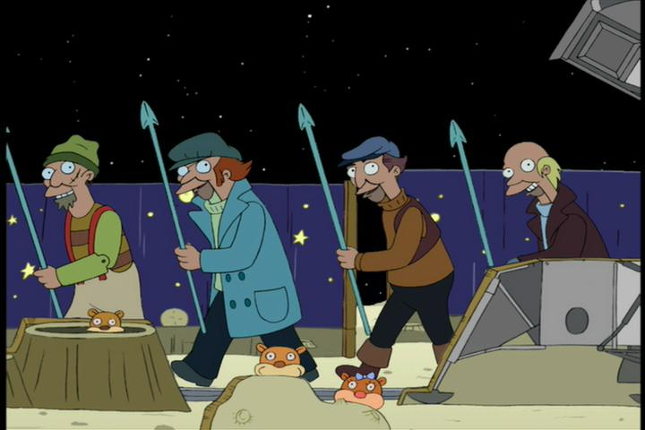

# Whaler of the moon

Just a bunch of dockerfiles

## Dockerfiles

### go-builder

| Base Image | Entrypoint | Extras | Dockerfile |
|------------|------------|--------|------------|
|`golang:1.13.0-alpine3.10`| None | * curl  * make  * nodejs  * npn  * golagci-lint  * gox  * goimports  * gomock  * mockgen| [Dockerfile](./go-builder/Dokerfile) |

#### build image

To build the image we have a [Makefile](./go-builder/Makefile), when running the targets we can set a different version for go, golangci-lint and the tag we create using environment variables:

* `GOLANG_VERSION`: Go version to use as base image. Default value: `1.13.0`
* `GOLANGCI_LINT_VERSION`: Version to install of `golangci-lint`. Default value: `1.18.0`
* `TAG`: Tag for the docker image, if not set `TAG` will use the same value as `GOLANG_VERSION`

Make targets:

* `make build`: Builds the docker image.
* `make push`: Push the image to the remote repository.